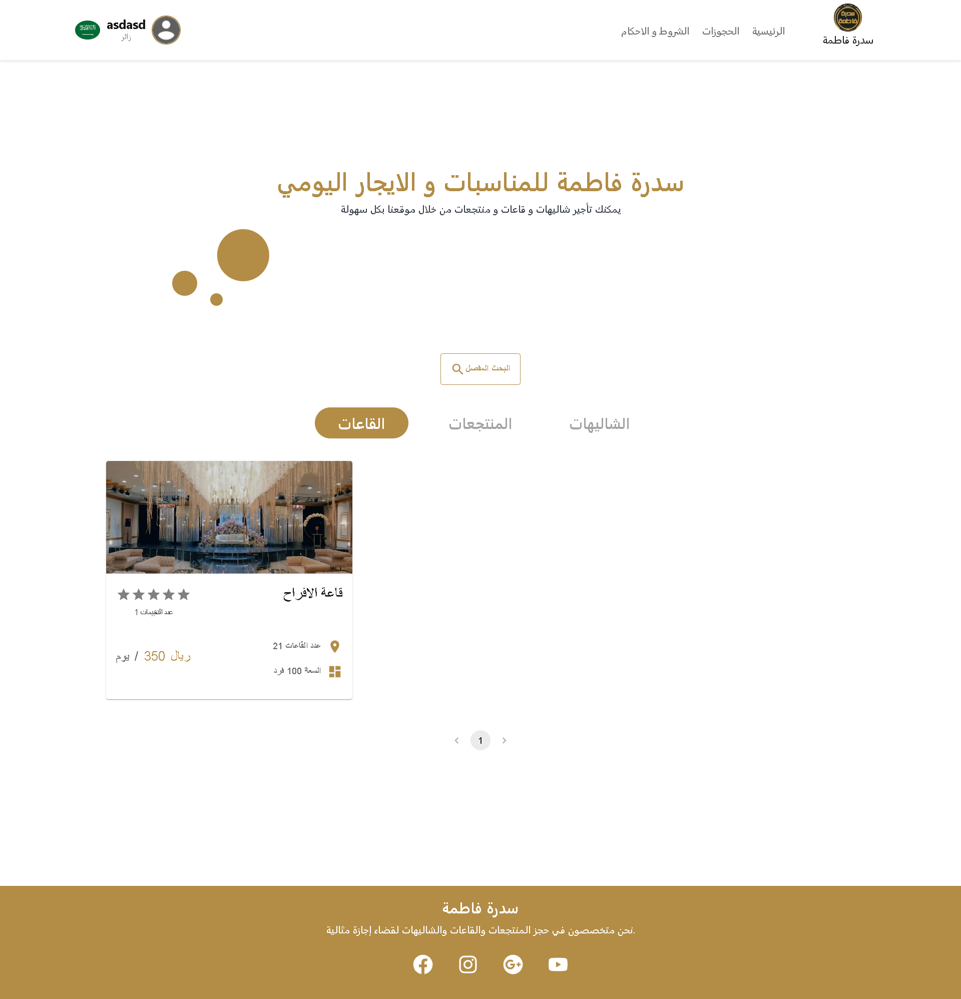
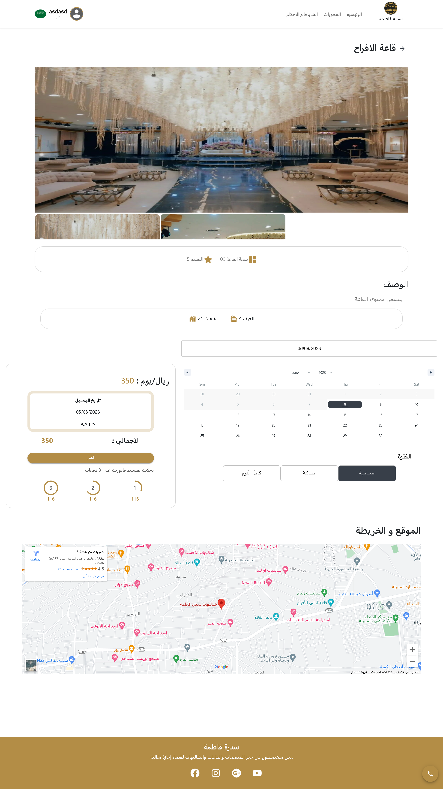
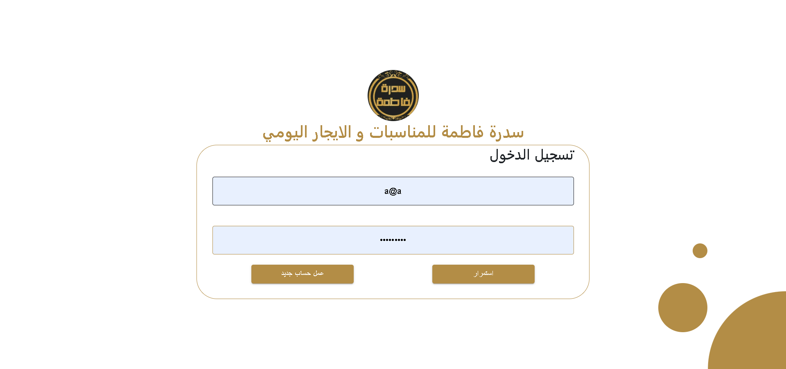
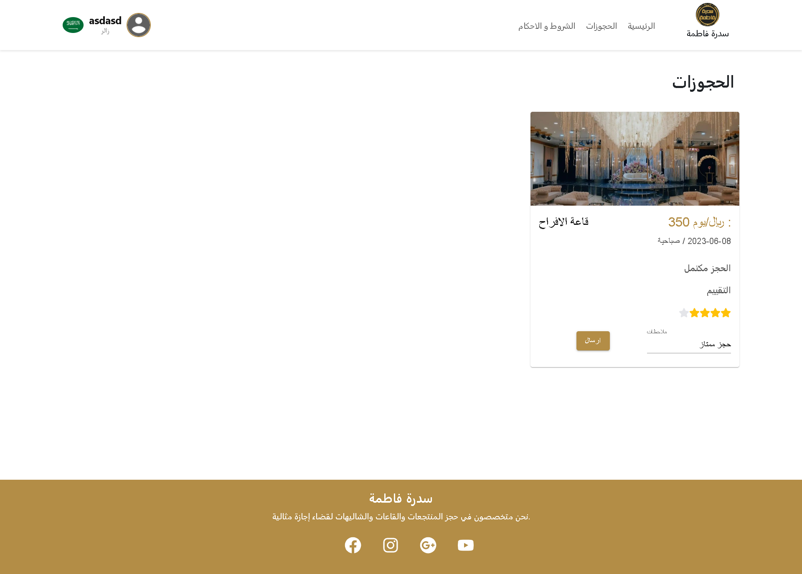

# User App

This is the README file for the User App, which is built using React, Axios, Material-UI (Mui), Bootstrap, and Redux Toolkit. The User App allows users to reserve chalets, halls, and resorts. It also includes a login/register system, and users can rate their reservation experience.

## Technologies Used

The User App is developed using the following technologies and libraries:

- React: A JavaScript library for building user interfaces.
- Axios: A popular library for making HTTP requests to the server.
- Material-UI (Mui): A UI component library that provides pre-built React components following the Material Design principles.
- Bootstrap: A CSS framework that helps with responsive web design and provides ready-to-use components.
- Redux Toolkit: A library that simplifies the management of state in React applications by providing a predictable state container.

## Features

1. Reservation System: Users can reserve chalets, halls, and resorts through the User App.
2. Login/Register: The User App includes a user authentication system that allows users to create new accounts or log in with existing ones.
3. Rating System: After making a reservation, users can rate their experience with the reservation entity.

## App Pages

The User App consists of the following pages:

1. Home Page:
   - 

2. Reservation Page:
   - 

3. Login/Register Page:
   - 

4. Rating Page:
   - 

