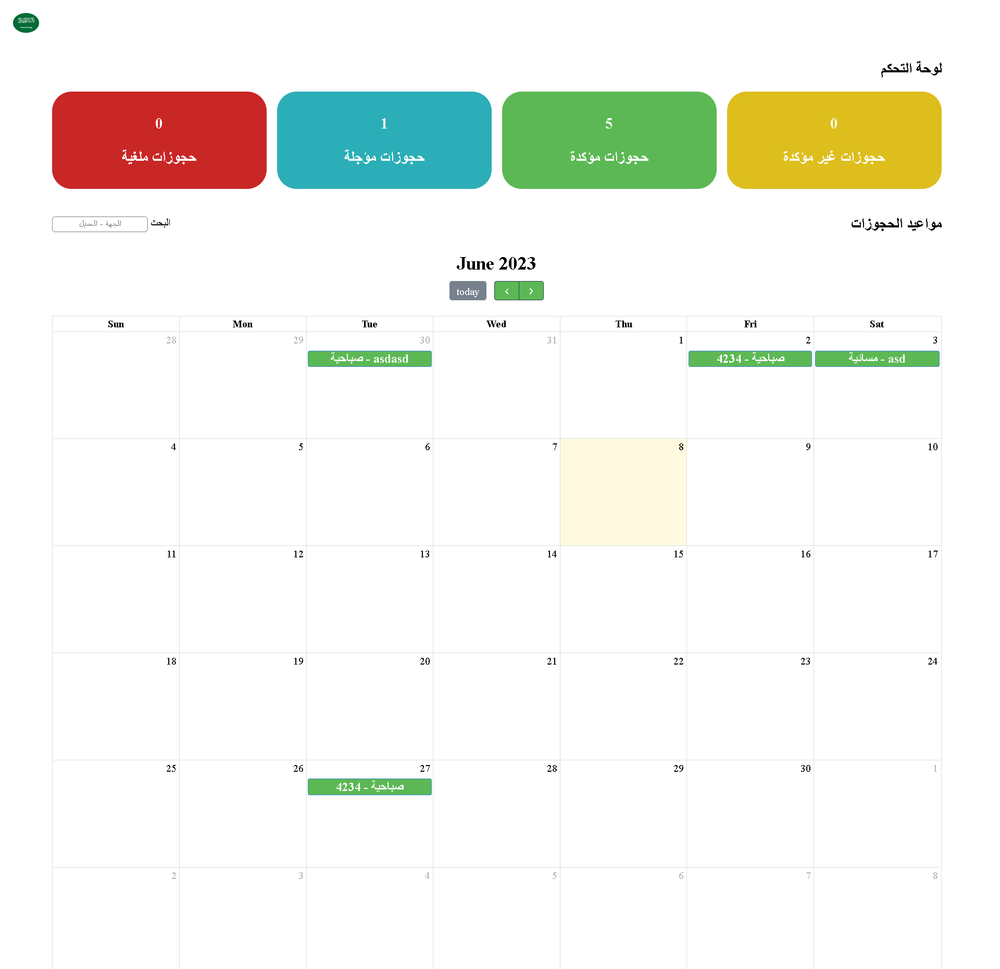
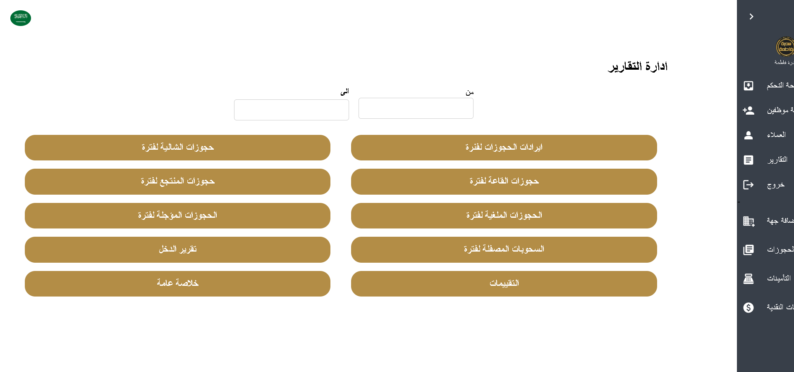

# Admin App

This is the README file for the Admin App, which allows administrators to manage entities like chalets, resorts, and halls. The Admin App also provides functionality to accept and reject reservations and includes pages for finance and reporting.

## Technologies Used

The Admin App is developed using the following technologies and libraries:

- React: A JavaScript library for building user interfaces.
- Axios: A popular library for making HTTP requests to the server.
- Material-UI (Mui): A UI component library that provides pre-built React components following the Material Design principles.
- Bootstrap: A CSS framework that helps with responsive web design and provides ready-to-use components.
- Redux Toolkit: A library that simplifies the management of state in React applications by providing a predictable state container.

## Features

The Admin App includes the following features:

1. Entity Management: Administrators can add and manage entities like chalets, resorts, and halls.
2. Reservation Management: Administrators can accept and reject reservations made by users.
3. Finance Page: Administrators can access a dedicated page for financial information and management.
4. Reporting Page: Administrators can generate reports and access data analysis tools.

## App Pages

The User App consists of the following pages:

1. Dashboard Page:
   - 

2. Report Page:
   - 

3. Reservations Page:
   - 

